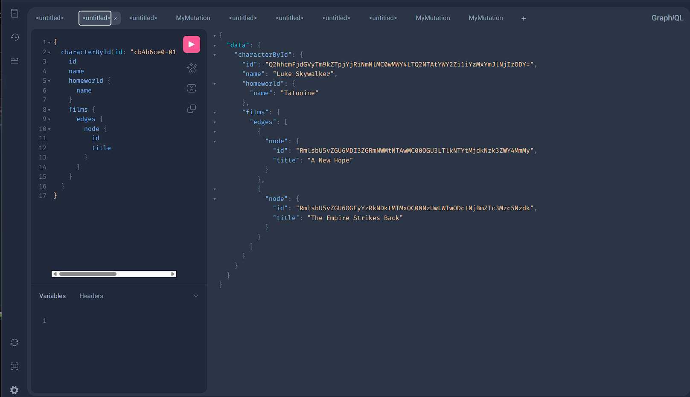
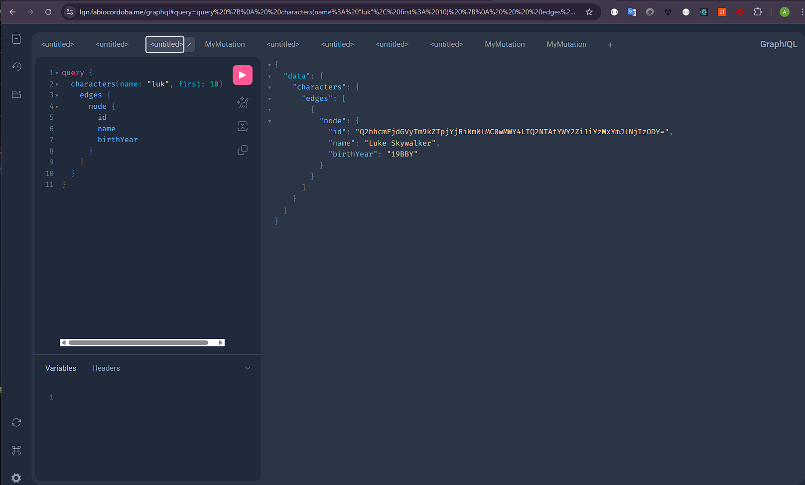
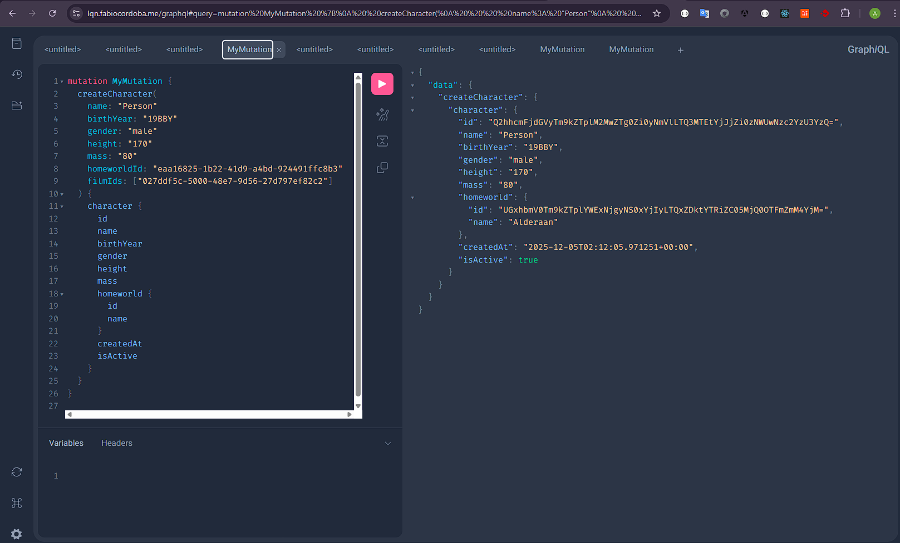
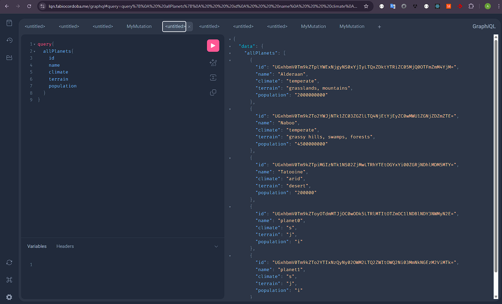
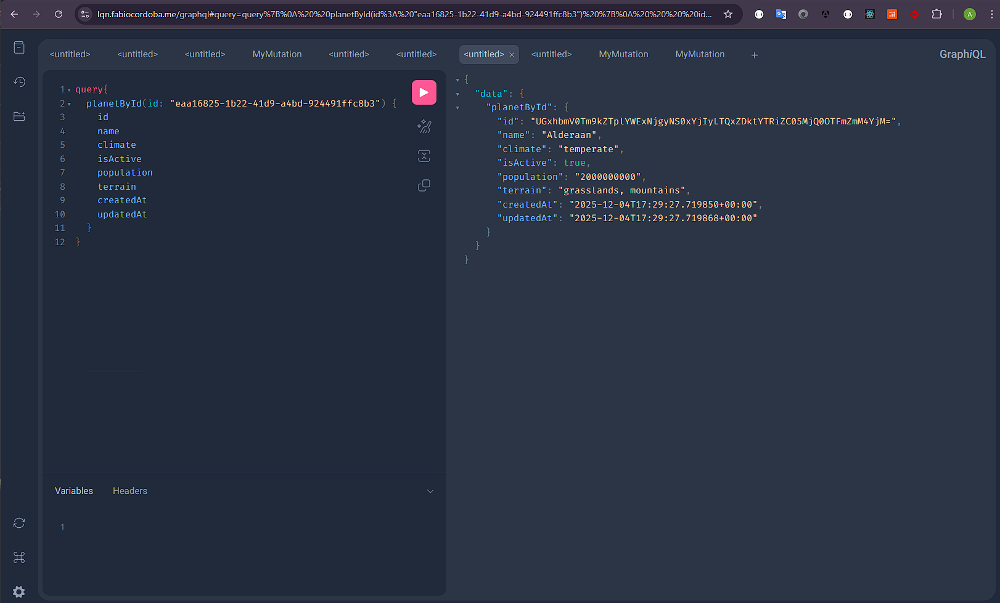
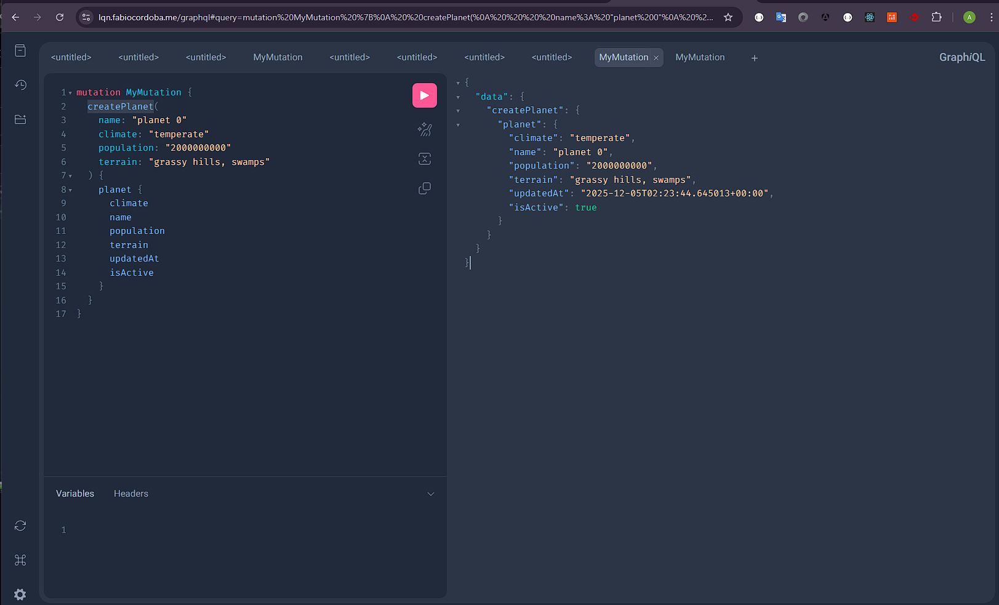
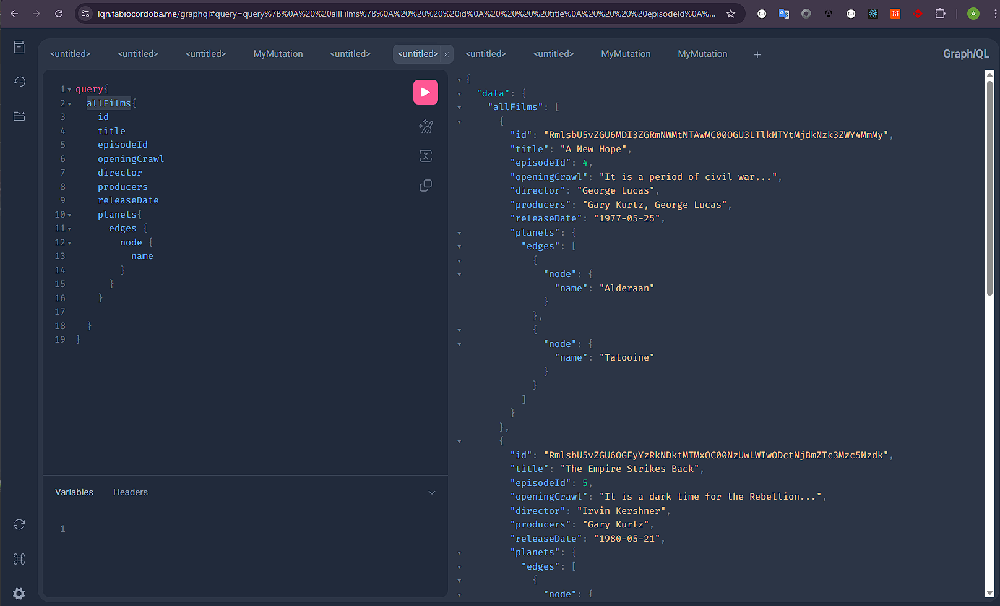
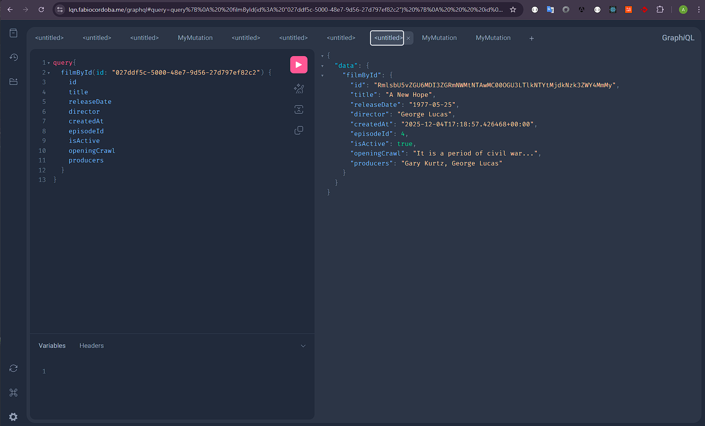
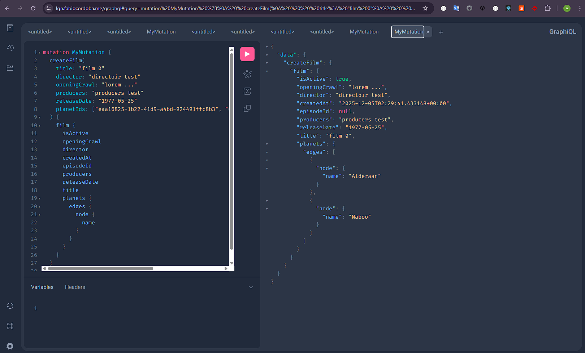

---

### Pruebas Unitarias con Pytest

---

### GraphQL Playground

### Todos los Personajes

---

### Personajes por ID

---

### Personajes filtrados por Nombre

### Crear Personaje

---

### Todos los Planetas

---

### Planeta por ID

---

### Crear Planeta

---

### Todos las Peliculas

---

### Pelicula por ID

---

### Crear Pelicula

---
